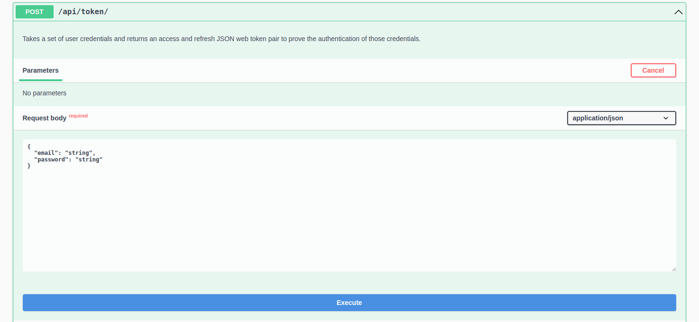
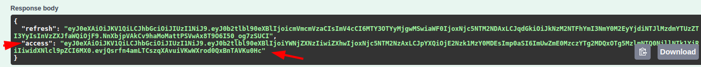
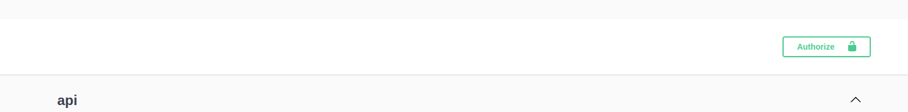

README - Controle de Cadastro de Funcionários

Este projeto tem como objetivo desenvolver uma plataforma de controle de cadastro de funcionários, permitindo cadastrar, listar, detalhar e inativar cadastros de colaboradores, além de gerenciar departamentos e empresas.

O projeto é desenvolvido utilizando Python e Django, com banco de dados MySQL.

Instruções de Utilização

Clonar o repositório:
git clone https://github.com/ThamiresSchifini/tourhouse.git

Instalar as dependências:
pip install -r requirements.txt

Configurar o banco de dados no arquivo settings.py.

Realizar as migrações do banco de dados:
python manage.py migrate

Criar um superusuário:
python manage.py createsuperuser

Iniciar o servidor local:
python manage.py runserver

Acessar o painel de administração em http://localhost:8000/admin e realizar o login com as credenciais do superusuário.

API

A API é protegida por autenticação, sendo necessário realizar o login com um usuário válido. Os endpoints disponíveis são:

* /api/docs/: É possível ver e testar todos os endpoints da aplicação com seus respectivos parâmetros.
* /employees/: Lista os funcionários cadastrados.
* /employees/detail/<id>: Detalha um funcionário específico.
* /employees/create/: Registra um novo funcionário.
* /employees/update/<id>/: Atualiza os dados de um funcionário específico.
* /employees/delete/<id>/: Inativa um funcionário específico.

* /departments/: Lista todas os departamentos cadastrados.
* /departments/detail/: Detalha um departamento específico.
* /departments/create/: Registra um departamento específico.
* /departments/update/<id>/: Atualiza os dados de um departamento específico.
* /departments/delete/<id>/: Inativa um departamento específico.

* /companies/: Lista todas empresa cadastradas.
* /companies/detail/<id>: Detalha uma empresa específica.
* /companies/create/: Registra uma nova empresa específica.
* /companies/update/<id>/: Atualiza os dados de uma empresa específica.
* /companies/delete/<id>/: Inativa uma empresa específica.

Além disso, é possível filtrar as pessoas por departamento, empresa e cidade, e os resultados são paginados.

Testes

Foram desenvolvidos testes unitários para a aplicação. Para executá-los, utilize o seguinte comando:
python manage.py test

Para utilizar a autenticação você deve acessar o http://127.0.0.1:8000/api/docs/#/api/api_token_create
no swagger 

e passar seus dados de superuser, pegar o token de acesso 

e passar em authorize

e depois testar as APIs.
